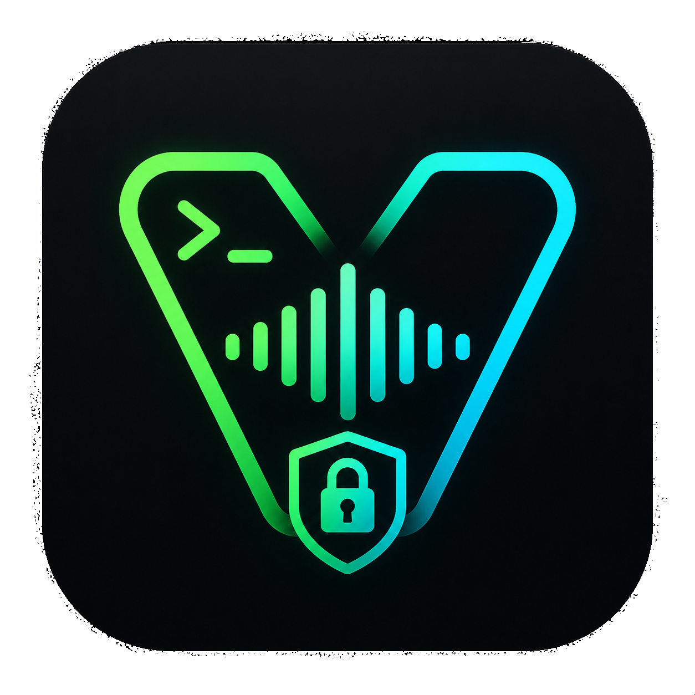

<p align="center">
  
</p>

# VOXTERM

Local real-time voice transcription TUI with speaker diarization and P2P collaborative transcription. Runs offline by default — optional Dialogues/Topos transcript push when you opt in.


## Privacy & Storage Policy

VoxTerm is **local first and private by default**. Transcription and speaker recognition run on your machine. **Nothing is sent to a server unless you attach Dialogues and enable Topos push** (or use optional Hivemind / party mode on your LAN).

- **No audio is stored.** Microphone input is processed in real-time and discarded. Only text transcripts are saved locally.
- **Voice profiles are encrypted at rest.** Speaker embeddings (biometric data used to recognize voices across sessions) are encrypted with AES-256-CBC. The key lives in your macOS Keychain — zero config.
- **Transcripts are yours.** Auto-saved as markdown to `~/Documents/voxterm-transcripts/`.
- **Topos push is opt-in.** Press **D** → attach once → turn on push when you want transcripts in Topos.
- **P2P stays on your LAN.** Party mode shares transcripts over your local network only. No relay servers.
- **Delete everything anytime.** Press **P** → delete to permanently wipe all voice data from disk.

## Install

One command:

```bash
curl -fsSL https://github.com/dialoguesai/VoxTerm/releases/latest/download/install.sh | bash
```

Then run:

```bash
voxterm
```

Runs on macOS and Linux, Python 3.12+. Apple Silicon Macs use MLX models; Intel Macs and Linux use the CPU-compatible faster-whisper / Qwen3-ASR (PyTorch) backends. Models download automatically on first use.

<details>
<summary>Manual setup (for developers)</summary>

```bash
git clone https://github.com/dialoguesai/VoxTerm.git
cd VoxTerm
just run          # creates .venv, installs, starts TUI
```

Or manually:

```bash
git clone https://github.com/dialoguesai/VoxTerm.git
cd VoxTerm
python3 -m venv .venv
source .venv/bin/activate
pip install -e .                 # add ".[streaming]" for the optional streaming ASR backend
python3 -m tui.app
```

</details>

## Controls

| Key | Action |
|-----|--------|
| `R` | Start/pause recording |
| `P` | Party mode — join or leave P2P sessions |
| `T` | Tag/name speakers |
| `O` | Speaker profiles |
| `M` | Switch transcription model |
| `L` | Switch language |
| `S` | Save/export transcript |
| `C` | Clear transcript |
| `D` | Dialogues — attach account / Topos push |
| `d` | Toggle debug mode |
| `?` | Help |
| `Q` / `Esc` | Quit |

## Party Mode (P2P)

Multiple people in the same room can share transcripts over the local network. Each laptop captures its closest speaker best — the combined result is better than any single mic.

**Press N** to join the party. Press N again to leave. No codes, no configuration.

- Auto-discovers nearby VoxTerm peers via mDNS
- Auto-joins the nearest party, or hosts one if none found
- Each party gets a unique color — all peers see the same color
- Encrypted transcript sharing (AES-256-GCM)
- Everyone sees who joins and leaves — no silent surveillance

See [docs/party-mode-design.md](docs/party-mode-design.md) for the full design.

## Dialogues / Topos (optional)

Save transcripts to your Topos node through Dialogues:

1. Press **D** and sign in when your browser opens.
2. Press **D** again and turn on **Send transcripts to Topos**.
3. Press **R** to record as usual.

Everything still runs locally until you turn push on. Attach once; push stays off until you enable it. See [docs/dialogues-integration.md](docs/dialogues-integration.md) for how it works under the hood.

## Hivemind mode (transcript streaming to swf-node)

Voxterm can stream transcript batches to a "convent box" running
`swf-node --full --hivemind-sink`. The sink wraps each batch in a
signed bundle and propagates it on the LAN.

By default voxterm auto-discovers sinks via mDNS. To override:
```
voxterm --hivemind-sink-url=http://convent.local:7777
```

Or disable entirely:
```
voxterm --hivemind=off
```

Mode flag: `--hivemind=auto|on|off`
- `auto` (default): mDNS-discover; fall back to local logging only.
- `on`: require a sink (fails to start if discovery times out after 5s).
- `off`: never POST; everything stays local.

Your voxterm device gets a persistent UUID stored at
`~/Library/Application Support/voxterm/device_id` (macOS) or
`~/.config/voxterm/device_id` (Linux); it appears in every batch as
`origin_device`. (It is a stable identifier, not a cryptographic
identity — the convent sink signs the bundle.)

Cadence: voxterm flushes a batch every ~60s, every 30 segments, or on
exit, whichever comes first. Batches POST to
`<sink>/hivemind/transcripts` per spec §4.3.

See `SHAPE-ROTATOR-OS-SPEC.md` §3.5 and §4.3 in
`shape-rotator-wrld-knwldge-viz` for the wire format.

## Voice Tagging

VoxTerm learns and remembers speaker voices across sessions:

1. Record a conversation — speakers are detected as "Speaker 1", "Speaker 2", etc.
2. Press `T` to name them — type a name, press Enter
3. Next session, VoxTerm auto-recognizes returning speakers
4. The more you tag, the less you need to — the system learns over time

Press `P` to manage your speaker profile library (rename, delete, wipe all data).

## Models

- **qwen3-0.6b** — fast, good for most use
- **qwen3-1.7b** — more accurate, larger
- **fw-small** (Intel Mac default) — CPU-compatible faster-whisper backend
- Whisper variants (tiny through large-v3) available via `M` menu

Models download automatically on first use.

### Optional: streaming ASR (cross-platform, CPU)

`pip install "voxterm[streaming]"` adds a sherpa-onnx **streaming** backend (word-by-word,
CPU-only, Linux/macOS-arm64/Windows) with two model keys — `sherpa-stream-en` (zipformer-20M,
ultra-fast) and `sherpa-nemotron-en` (NeMo 0.6B, accurate). Fully opt-in: absent, nothing
changes. See [docs/streaming-asr.md](docs/streaming-asr.md) and the
[benchmark](docs/streaming-asr-benchmark.md).

### Android: the same GUI, on-device (offline)

The Android app runs the **same web GUI as the desktop**, but with a native on-device engine instead
of the Python backend: it records, then transcribes **entirely on the phone** with offline Whisper
via [`tauri-plugin-voxasr/`](tauri-plugin-voxasr/) — no pairing, no relay, **no network** (the APK
strips the `INTERNET` permission). Build it with `scripts/android-dev.sh --debug` (it fetches the
bundled model on first run). `whisper-base.en` ships by default; set
`VOXASR_MODEL=whisper-small.en` for higher accuracy. See
[tauri-plugin-voxasr/README.md](tauri-plugin-voxasr/README.md).

**Just want to install it?** CI publishes a prebuilt, signed APK on every mobile change —
grab `VoxTerm-android-arm64.apk` from the [`android-latest` release](https://github.com/dmarzzz/VoxTerm/releases/tag/android-latest)
and follow the [Android install guide](docs/android-install.md) (sideload, or auto-update via Obtainium).

## Project Structure

```
audio/              Capture, VAD, transcription, diarization, speaker profiles
dialogues/          Dialogues attach + Topos transcript push (optional)
network/            P2P: discovery, sessions, party mode, hivemind sink
tui/                App, widgets, theme
tests/              Test suite
docs/               Design docs and specs
config.py           Constants, paths, settings
justfile            Dev shortcuts: just run, just test, just setup
```
